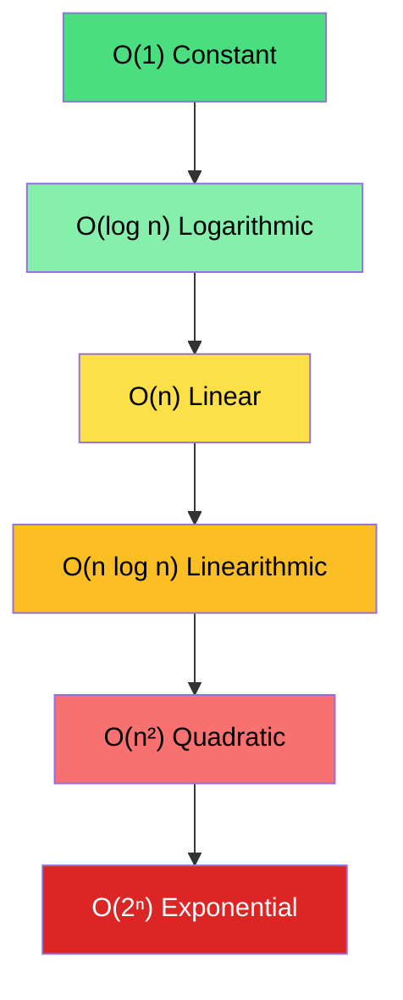
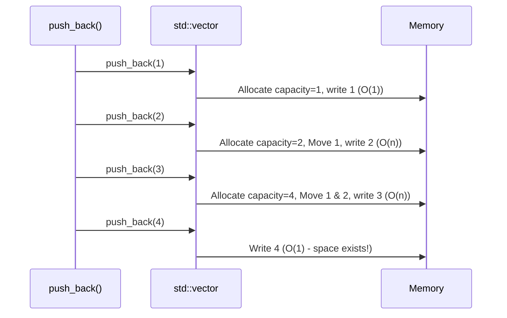
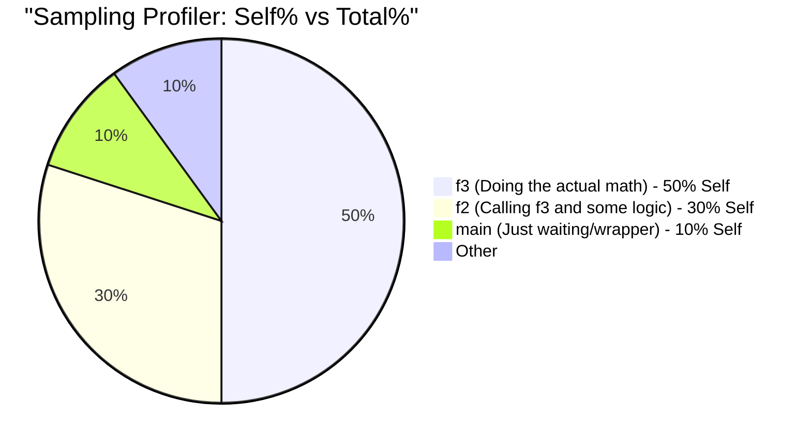
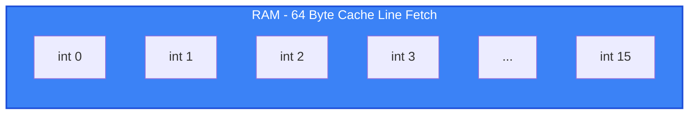

# Deep Dive: Analyzing and Measuring C++ Performance

This document provides a comprehensive, in-depth explanation of the core concepts of performance measurement and analysis in C++, based on the notes and code examples from Chapter 3/4. 

We cover five major topics:
1. Asymptotic Complexity & Big O
2. Amortized Complexity
3. Performance Properties (Latency vs Throughput)
4. Profilers (Instrumentation vs Sampling)
5. Cache Effects and Locality

---

## 1. Asymptotic Complexity & Big O Notation

### Concept
Big O notation expresses the **growth rate** of an algorithm's runtime or memory usage as the input size ($n$) scales towards infinity. It helps us abstract away hardware-specific speeds and constant factors, focusing solely on the algorithm's inherent efficiency.

> [!TIP]
> **Golden Rule:** Never spend time micro-optimizing your code before you are certain you have chosen the correct algorithms and data structures. A bad algorithm (e.g., $O(n^2)$) will always lose to a good one (e.g., $O(n \log n)$) at scale, no matter how much you tune the inner loop.

### Common Growth Rates



### Code Examples

#### O(n) - Linear Search
In the worst case (the element is at the end or not present), we must inspect every element once.

```cpp
bool linear_search_int(const std::vector<int>& vals, int key) {
    for (const auto& v : vals) {   // Loops at most n times → O(n)
        if (v == key) return true;
    }
    return false;
}
```

#### O(log n) - Binary Search
In a sorted array, we halve the search space at each step. This means if $n = 1000$, we only need about 10 steps ($2^{10} \approx 1000$).

```cpp
bool binary_search_int(const std::vector<int>& a, int key) {
    if (a.empty()) return false;
    size_t low = 0, high = a.size() - 1;
    while (low <= high) {
        const size_t mid = low + ((high - low) / 2);  // Avoids overflow
        if      (a[mid] < key) low  = mid + 1;
        else if (a[mid] > key) high = mid - 1;
        else                   return true;
    }
    return false;
}
```

#### O(n²) - Insertion Sort
For every element, we potentially compare it against all previously sorted elements. The outer loop runs $n$ times, and the inner loop runs up to $n$ times, resulting in $\approx n^2 / 2$ operations.

```cpp
void insertion_sort(std::vector<int>& a) {
    for (size_t i = 1; i < a.size(); ++i) {
        size_t j = i;
        while (j > 0 && a[j-1] > a[j]) {
            std::swap(a[j], a[j-1]);
            --j;
        }
    }
}
```

---

## 2. Amortized Complexity

### Concept
Amortized complexity guarantees an average cost over a **sequence** of operations, even if a single operation within that sequence is occasionally very expensive. This is different from "average case" complexity, which depends on the distribution of inputs.

### `std::vector::push_back`
When a `std::vector` runs out of capacity, it must allocate a new, larger buffer and move all existing elements over. This single operation is $O(n)$. However, because the capacity typically **doubles** each time, the expensive operations happen exponentially less frequently.



Over $n$ pushes, the total work for all reallocations is $n/2 + n/4 + n/8 + \dots \approx n$. Therefore, $n$ operations take $O(n)$ time, making the amortized cost **$O(1)$ per push**.

> [!CAUTION]
> **HFT Context:** While `push_back` is amortized $O(1)$, an unexpected $O(n)$ reallocation during a latency-critical path is disastrous. **Always use `reserve()` upfront** to ensure 0 reallocations on the hot path, achieving worst-case $O(1)$ performance.

### Code Proof: Tracking Vector Growth
```cpp
void section_reserve() {
    constexpr int N = 1000;

    // Without reserve: triggers multiple reallocations
    std::vector<int> v_unreserved;
    // v_unreserved.push_back(...) in loop causes O(n) jumps
    
    // With reserve: 0 reallocations
    std::vector<int> v_reserved;
    v_reserved.reserve(N); // Allocate once upfront
    for (int i = 0; i < N; ++i) {
        v_reserved.push_back(i); // Guaranteed O(1) worst-case here!
    }
}
```

---

## 3. Performance Properties & Vocabulary

Understanding how to measure system performance is just as crucial as writing the code.

| Property | Definition | Optimization Target |
| :--- | :--- | :--- |
| **Latency** | Time taken to process a single request from start to finish. | Algorithmic efficiency, cache locality, removing locks. |
| **Throughput** | Number of operations processed per unit of time (e.g., requests/sec). | Concurrency, batching, minimizing I/O bottlenecks. |
| **CPU-Bound** | System speed is limited by CPU execution speed. | Optimize math, loops, use SIMD. |
| **Memory-Bound** | System speed is limited by RAM latency/bandwidth. | Improve cache locality (SoA vs AoS). |

### Why Percentiles Matter
In latency-sensitive applications like High-Frequency Trading (HFT), the **mean (average) is dangerously deceptive**. It hides outliers caused by cache misses, OS scheduling, or garbage collection.

We use **percentiles** instead:
- **p50 (Median):** 50% of requests are faster than this.
- **p99:** 99% of requests are faster. The 1% tail latency.
- **p99.9:** Critical in HFT. A high p99.9 indicates intermittent stalling.

---

## 4. Profilers: Instrumentation vs. Sampling

To apply the **Pareto Principle** (80% of execution time lives in 20% of the code), we need profilers to find the 20%.

### Instrumentation Profilers
Code is explicitly injected into functions to record entry and exit times.

**Pros:** 100% accurate call counts and timings.
**Cons:** The added code alters the performance being measured (Observer effect) and blocks compiler optimizations like inlining.

```cpp
// RAII Timer using steady_clock (monotonic, avoids NTP jumps)
class ScopedTimer {
    using ClockType = std::chrono::steady_clock;
    const char* function_;
    const ClockType::time_point start_;
public:
    explicit ScopedTimer(const char* func) : function_{func}, start_{ClockType::now()} {}
    ~ScopedTimer() {
        auto duration = std::chrono::duration_cast<std::chrono::nanoseconds>(
            ClockType::now() - start_
        );
        std::cout << function_ << " took " << duration.count() << " ns\n";
    }
};

// Zero-cost macro when profiling is disabled
#ifdef USE_TIMER
    #define MEASURE_FUNCTION() ScopedTimer _timer_{__func__}
#else
    #define MEASURE_FUNCTION()
#endif
```

### Sampling Profilers
The OS interrupts the program at fixed intervals (e.g., every 10ms) and records the current call stack.



- **Total%:** How often the function appeared anywhere on the stack.
- **Self%:** How often the function was actively executing at the top of the stack. **Optimize high Self% functions.**

> [!WARNING]
> **Sleeping Threads are Invisible:** Sampling profilers only see threads scheduled on the CPU. If your thread is blocked on a mutex or I/O, it won't appear in the sample! You need kernel tracers (e.g., `perf sched`, eBPF) to debug lock contention.

---

## 5. Cache Effects and Locality

Memory access is no longer $O(1)$ in the modern world. Fetching from RAM is ~200x slower than fetching from the L1 cache.

- **L1 Cache:** ~0.5 ns
- **L2 Cache:** ~7 ns
- **Main RAM:** ~100 ns

When the CPU requests 1 byte, it pulls an entire **Cache Line** (usually 64 bytes) from RAM.

### Spatial Locality
Accessing data that is close together in memory is nearly free because it is already in the cache line.



**Vector vs Linked List:**
- `std::vector` stores elements contiguously. Iterating through it utilizes spatial locality beautifully.
- A Linked List (`Node* next`) allocates elements randomly on the heap. Traversing it causes a **cache miss** on almost every pointer chase, making it 10x-50x slower in practice.

### Cache Thrashing
When you access memory in strides larger than the cache line, you evict data before you can reuse it.

**Example: Matrix Traversal**
```cpp
// Cache Friendly (Spatial Locality) - ~40ms
for (int i = 0; i < N; ++i)
    for (int j = 0; j < N; ++j)
        matrix[i][j] = 0; // Row-major: elements are adjacent in memory

// Cache Thrashing - ~800ms (20x slower!)
for (int i = 0; i < N; ++i)
    for (int j = 0; j < N; ++j)
        matrix[j][i] = 0; // Col-major: jumps N*4 bytes every iteration. Cache miss!
```

### SoA vs AoS (HFT Pattern)
When iterating over massive datasets, how you group your data defines your cache efficiency.

**AoS (Array of Structs)**
```cpp
struct PriceLevel { double bid; double ask; int size; int pad; }; // 32 bytes
std::vector<PriceLevel> book;
```
If you only want to average the `bid` prices, you pull 32 bytes into the cache line, but only use 8 bytes. 75% of your cache bandwidth is wasted on `ask` and `size`.

**SoA (Struct of Arrays)**
```cpp
struct OrderBook {
    std::vector<double> bids;
    std::vector<double> asks;
    std::vector<int> sizes;
};
```
If you scan `OrderBook::bids`, you load 64 bytes of pure `bid` prices per cache line. 0% waste. SoA dramatically outperforms AoS when algorithms process specific fields independently.
